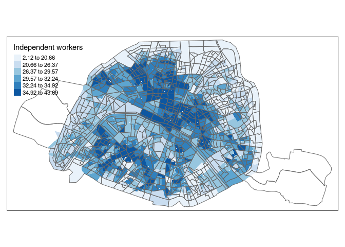

[](https://travis-ci.org/joelgombin/spReapportion)

<!-- README.md is generated from README.Rmd. Please edit that file -->
This (very small) package provides a function to reapportionate data from one set of spatial polygons to another. This is useful, e.g., when one has some data which is distributed in some administrative units (e.g., the IRIS, the infra-urban unit at which the INSEE, the French national statistics institute, releases the census data) and needs to have it in some other units (e.g., "bureaux de vote", the French polling stations).

At the moment, the package only offers the option to reapportion data by hypothesising homogeneous repartition of the variable inside a unit. I have plans to implement other schemes in the future. If you are aware of some alternative schemes, please [submit an issue](https://github.com/joelgombin/spReapportion/issues).

Also, for the time being, the agregation function being used is the sum, but I plan to allow for more agregation functions (possibly personalised). However, the pckage allows for dealing with proportions (only in the 0-1 range; if your proportions are expressed in the 0-100 range, please transform them) rather than counts: simply use the `mode="proportion"` argument, and don't forget to include weights with the `weights` argument (usually the total number of observations per unit).

Installation
============

This package is not on CRAN. For the time being, install it via the `devtools` package:

``` r
devtools::install_github("joelgombin/spReapportion")
```

Usage
=====

There is only one function for the time being in this package. The usage is as such:

``` r
library(spReapportion)
#> Loading required package: sp
#> Loading required package: maptools
#> Checking rgeos availability: TRUE
#> Loading required package: rgeos
#> rgeos version: 0.3-12, (SVN revision 498)
#>  GEOS runtime version: 3.4.2-CAPI-1.8.2 r3921 
#>  Linking to sp version: 1.1-1 
#>  Polygon checking: TRUE
data(ParisPollingStations2012)
data(ParisIris)
data(RP_2011_CS8_Paris)
CS_ParisPollingStations <- spReapportion(ParisIris, ParisPollingStations2012, RP_2011_CS8_Paris, "DCOMIRIS", "ID", "IRIS")
```

You can then make sure that everything went fine, for example by comparing maps of the same data before and after reapportionment. Here, I'll use the great `tmap` package.

``` r
library(tmap)
#> Loading required package: raster
library(dplyr)
#> 
#> Attaching package: 'dplyr'
#> 
#> The following objects are masked from 'package:raster':
#> 
#>     intersect, select, union
#> 
#> The following objects are masked from 'package:rgeos':
#> 
#>     intersect, setdiff, union
#> 
#> The following objects are masked from 'package:stats':
#> 
#>     filter, lag
#> 
#> The following objects are masked from 'package:base':
#> 
#>     intersect, setdiff, setequal, union

# first transform counts to percentages

RP_2011_CS8_Paris <- RP_2011_CS8_Paris %>%
  mutate_each(funs(. / C11_POP15P * 100), C11_POP15P_CS1:C11_POP15P_CS8)

# add data to the SPDF
ParisIris <- append_data(ParisIris, RP_2011_CS8_Paris, key.shp = "DCOMIRIS", key.data = "IRIS")
#> Keys match perfectly.

# plot original census units (IRIS)

tm_shape(ParisIris) +
  tm_fill(col = "C11_POP15P_CS3", palette = "Blues", style = "quantile", n = 6, title = "Independent workers") +
  tm_borders()
```


``` r
# transform counts to percentages in the reapportionned data
CS_ParisPollingStations <- CS_ParisPollingStations %>%
  mutate_each(funs(. / C11_POP15P * 100), C11_POP15P_CS1:C11_POP15P_CS8)

ParisPollingStations2012 <- append_data(ParisPollingStations2012, CS_ParisPollingStations, key.shp = "ID", key.data = "ID")
#> Keys match perfectly.

tm_shape(ParisPollingStations2012) +
  tm_fill(col = "C11_POP15P_CS3", palette = "Blues", style = "quantile", n = 6, title = "Independent workers") +
  tm_shape(ParisIris, is.master = TRUE) +
  tm_borders()
```


